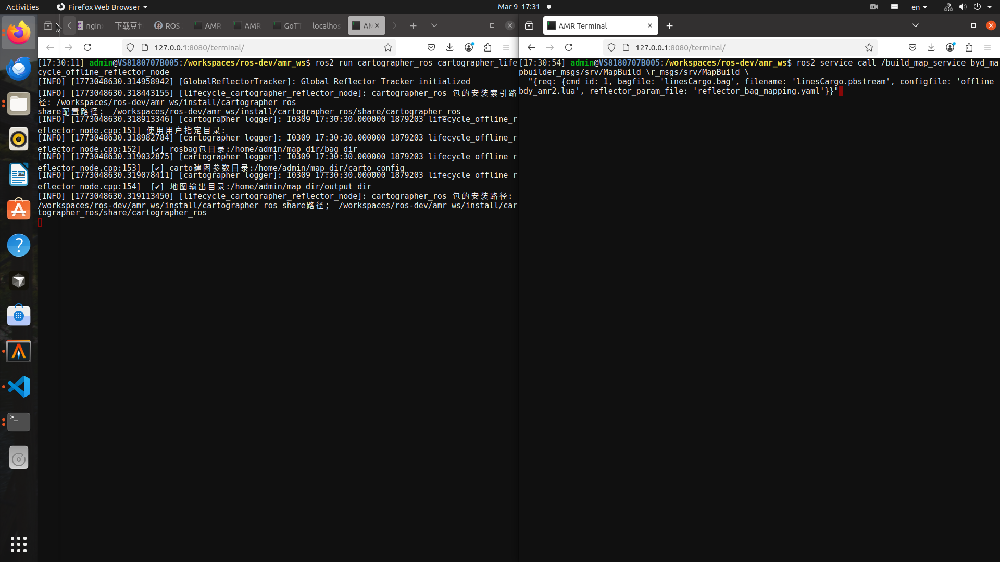
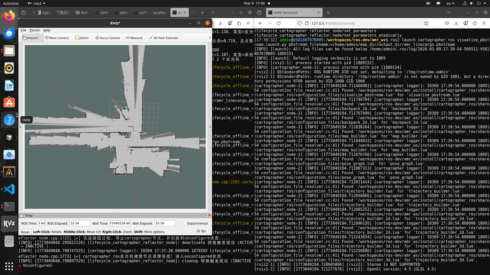

<!--
Author: LeonZack055 (Gmail)
docker-configure.md (c) 2026
Desc: description
@copyright Copyright (c)  <author> All rights reserved.
@license BSD 2-Clause License
Created:  2026-03-09T08:09:11.659Z
Modified: !date!
-->

# Docker服务
## 概述

本文档描述如何在已有的 Docker 容器（Ubuntu 22.04）内安装和配置 Nginx 与 GoTTY，实现通过 Web 浏览器访问后台终端。

**特别注意**：本文档针对使用 UID/GID 模式启动的容器，通过 `entry_point.sh` 切换到非 root 用户（admin）运行。

## 支持的浏览器
**功能**
- 文件服务器: 默认指向 `/home/admin/map_dir` 用于包管理，地图管理，参数文件服务配置; `http://localhost:8080/files`
- 终端服务: 通过gotty服务，实现web端访问后台终端; `http://localhost:8080` 代理跳转到终端服务; `http://localhost:9090`
- 监听端口: [8080, 9090]

## Dockfile 镜像配置
### docker login
**配置dockre代理**
在 /etc/docker/daemon.json 中加入harbor镜像地址:
```json
{
    "insecure-registries":["10.0.0.0/8"],
    "registry-mirrors":["http://10.4.0.233:5443"]
}
```
登陆amr的docker habor; 用户: `amr-dev` 密码: `Amrdev2354@`
```bash
docker login http://10.4.0.233:443 -u $USER_NAME
# 输入密码
```
再进行docker服务重启
```bash
sudo systemctl daemon-reload
sudo systemctl restart docker
```
### docker 镜像构建
构建docker-file。 创建一个文件，名字就叫 `Dockerfile`，内容如下
```yaml
# 直接拉取你推送到 harbor 的镜像
FROM 10.4.0.233:5443/amr/byd-image/software/x86/ros2/ubuntu22.04:latest

# 下面你可以继续加自己的内容（安装软件、拷贝文件、启动脚本等）
# 例如：
# COPY ./myfile /home/
# RUN apt-get update && apt-get install -y nginx
# CMD ["/start.sh"]
```
在 Dockerfile 所在目录执行：
```bash
docker build -t my-new-image:latest .
```


## Docker 运行方式

**方式：启动后手动启动服务**
默认情况下，docker容器在启动后不会自动启动服务，首次运行会自动执行nginx脚本服务;再次进入
docker容器以attch方式进入，不再进行nginx服务重启。
```bash
# 运行容器
./isaac_ros_docker.sh
```
**docker脚本** 具体参才考 [`isaac_ros_docker.sh`](./deployment/isaac_ros_docker.sh)

**修改脚本参数**:

- `ISAAC_ROS_DEV_DIR`: 指定容器内工作目录,例如: `ISAAC_ROS_DEV_DIR="/home/test/leon/ros_ws"`
- `IMAGE_NAME`: 指定容器镜像名称,例如: `IMAGE_NAME="10.4.0.233:5443/amr/byd-image/software/x86/ros2/ubuntu22.04:latest"` 对应`my-new-image:latest`

**入口脚本:** `/usr/local/bin/scripts/byd-ws-entrypoint.sh` 具体内容参考 [`byd-ws-entrypoint.sh`](./deployment/scripts/byd-ws-entrypoint.sh)

## 前端服务启动
能过浏览器访问 `http://localhost:8080` 进入到服务器，可手动调用离线建图服务

### 反光柱离线建图
默认指向参数服务器配置目录
```bash
ros2 run cartographer_ros cartographer_lifecycle_offline_reflector_node
```
具体参考: [`ros2-mapping-cli`](ros2-mapping-cli.md) 中反光柱离线建图部分。

#### 手动调用服务
测试用例:

```bash
ros2 service call /build_map_service byd_mapbuilder_msgs/srv/MapBuild \
"{req: {cmd_id: 1}, filename: "linesCargo.pbstream", bagfile: "linesCargo.bag", configfile: "offline_bdy_amr2.lua", reflector_param_file: "reflector_bag_mapping.yaml"}"
```


参数调节:
具体参数: 
- [`reflector-configure-info.md`](reflector-configure-info.md) 中反光柱参数配置。
- [`mapping-configure-info.md`](mapping-configure-info.md) 中cartographer参数配置。

### web服务调用
手动拉起 `ros_bridge_server`
```bash
ros2 launch rosbridge_server rosbridge_websocket_launch.xml port:=9091
```
局域网用户可能需要端口配置，用端口映射的方式进行绑定，可用于远程服务调用。

然后利用`ros2js-api`进行服务调用。 同手动服务调用方式。

### ubuntu端快速可视化
手动关闭反光柱建图服务进程，直接`Ctrl-C` 退出，然后执行。
```bash
ros2 launch cartographer_ros visualize_pbstream.launch.py pbstream_filename:=/home/admin/map_dir/output_dir/linesCargo.pbstream
```
